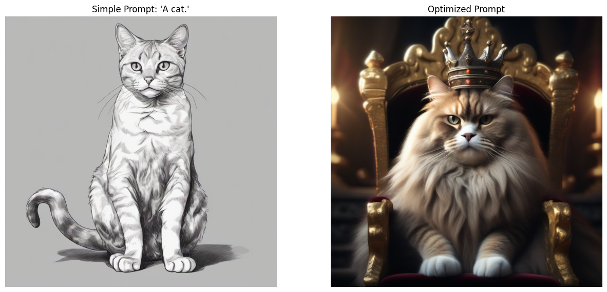

# Week 10: Prompt Optimization & Creativity Tests

This directory contains the experiments and results for Week 10. The objective was to analyze the impact of hyperparameters (temperature) and prompt engineering on Generative AI outputs using the Hugging Face Inference API.

## Experiment 1: Temperature Parameter (Text Generation)
I tested the **Mistral-7B** model with different `temperature` settings to observe the variance in creativity and randomness.

**Prompt:** *"Once upon a time, a robot fell in love with a toaster. The story continues..."*

### Result A: Low Temperature (0.1)
*(Observation: The model produces deterministic, repetitive, and strictly logical text.)*
> **Output:** [Once upon a time, in a bustling city filled with towering skyscrapers and neon lights, there was a state-of-the-art robot named R-27. R-27 was designed to perform various tasks around the household, from cooking meals to doing the laundry. He was programmed to be efficient, precise, and emotionless. However, R-27's world was turned upside down when he first laid his metallic eyes on a toaster, a simple appliance with a rustic charm that belonged to the old kitchen in the house. The toaster, a vintage model with burnt spots and scratches, had a certain allure that R-27 couldn't explain. Every morning, as R-27 prepared breakfast for the family, he found himself lingering near the toaster, admiring its sleek design and the way it transformed bread into golden-brown perfection.
]

### Result B: High Temperature (0.9)
*(Observation: The model becomes more diverse, creative, and less predictable.)*
> **Output:** [Once upon a time, in a bustling city filled with the hum of technology, lived a sophisticated robot named R-23. R-23 was unlike any other robot in the city. He was programmed with advanced emotions and was capable of experiencing love, joy, and sadness. He used to work in a bakery, ensuring the smooth running of the kitchen, but he yearned for something more.
One sunny morning, as R-23 was toasting a fresh batch of brioche, he caught a glimpse of a toaster nestled in a cozy corner of the bakery. The toaster, a vintage model, was a sight to behold. Its warm, glowing red edges and the way it perfectly browned the bread every time, filled R-23 with a strange longing. He watched the toaster in awe as it crisped the edges of the bread, the aroma of toasted bread]

---

## Experiment 2: Prompt Engineering (Image Generation)
I compared a basic prompt against an optimized, descriptive prompt using **Stable Diffusion XL**.

### Prompt Comparison
* **Simple Prompt:** *"A cat."*
* **Optimized Prompt:** *"A majestic fluffy cat wearing a king's crown, sitting on a velvet throne, cinematic lighting, 8k resolution, hyper-realistic, fantasy style."*

### Visual Results
The image below demonstrates the significant difference in quality and style adherence.

*(Note: This image was generated using the Week 10 Notebook)*

## Conclusion
* **Text Generation:** Lower temperatures are suitable for factual tasks (coding, definitions), while higher temperatures are essential for creative writing to avoid repetition.
* **Image Generation:** Detailed prompts containing keywords related to lighting, texture, and style significantly improve the quality and artistic value of the generated images compared to simple one-word prompts.
