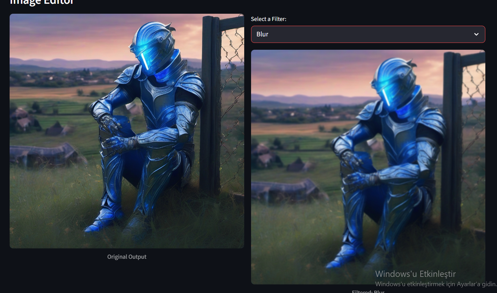
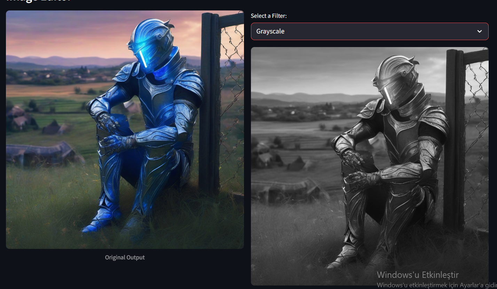
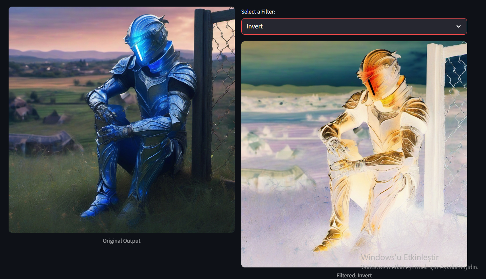

# Week 11: Artistic Style Enhancement (Image Filters)

This directory contains the deliverables for Week 11. The objective was to integrate post-processing capabilities into the Streamlit application using the **Pillow** library.

## Features Added
* **Filter Selection UI:** A selectbox allows users to choose different artistic filters after image generation.
* **Session State Management:** Ensures the generated image persists while switching between filters, preventing unnecessary API calls.
* **Image Processing:** Implemented using `PIL.ImageOps` and `PIL.ImageFilter`.

## Available Filters
1.  **Grayscale:** Converts the image to black and white using `ImageOps.grayscale`.
2.  **Blur:** Applies a Gaussian Blur effect.
3.  **Contour:** Extracts and highlights edges in the image.
4.  **Invert:** Inverts the color channels (negative effect).
5.  **Sharpen:** Enhances the edges for a crisp look.

## Sample Outputs
The screenshot below demonstrates the **Grayscale** filter applied to a generated image of a cyberpunk city.

## Technical Implementation
The filters are applied locally within the Streamlit app logic, meaning the image generation happens on the cloud (Hugging Face), but the artistic filtering happens on the app server using CPU resources efficiently.
